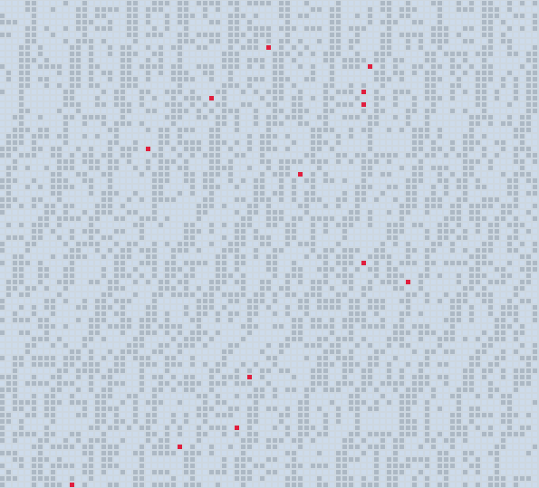

# Javascript and CSS tiny boxes

 Colored boxes drawn by JS and CSS based on bit value of Shakespeare quotes characters.

## Usecase

I wanted a seemingly random background image with a hidden message for use on the web. The low number of unique colors keeps the file size relatively low

## screenshot



## how it works

Each character is represented by 8 squares that is either 0 or 1

- A = ascii 65 =  01000001
- z = ascii 122 = 01111010

### styles.css

- 0 = .box0 in styles.css
- 1 = .box1 in styles.css

Each quote is then seperated by a 3rd colored square, red.
new quote = .box2 in styles.css

### Colors used in styles.css


```css
.box0 {
    background-color: #cddbeb; 
}
.box1 {
    background-color: #acb8c4;
}
.box2 {
    background-color: #e01e3e;
}
```
